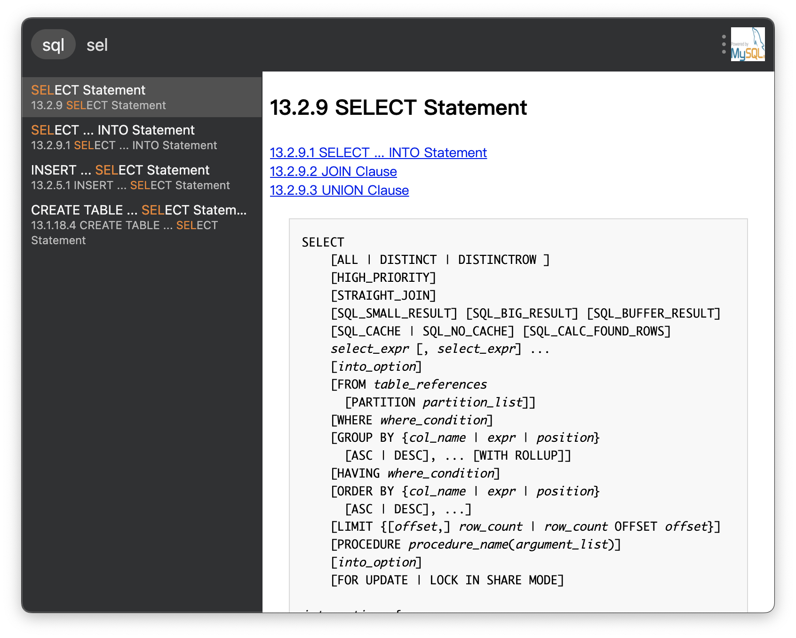

### [utools](https://u.tools) 文档速查插件 | MySQL5.7 SQL文档速查

> 参与该插件翻译：[https://gitlocalize.com/repo/8436](https://gitlocalize.com/repo/8436) 
_(很明显这件事放在现在的价值观念里不值得完成)_

|                            预览                             |
| :------------------------------------------------------: |
|  |

> 文档来源：[https://dev.mysql.com/doc/refman/5.7/en/sql-statements.html](https://dev.mysql.com/doc/refman/5.7/en/sql-statements.html)
